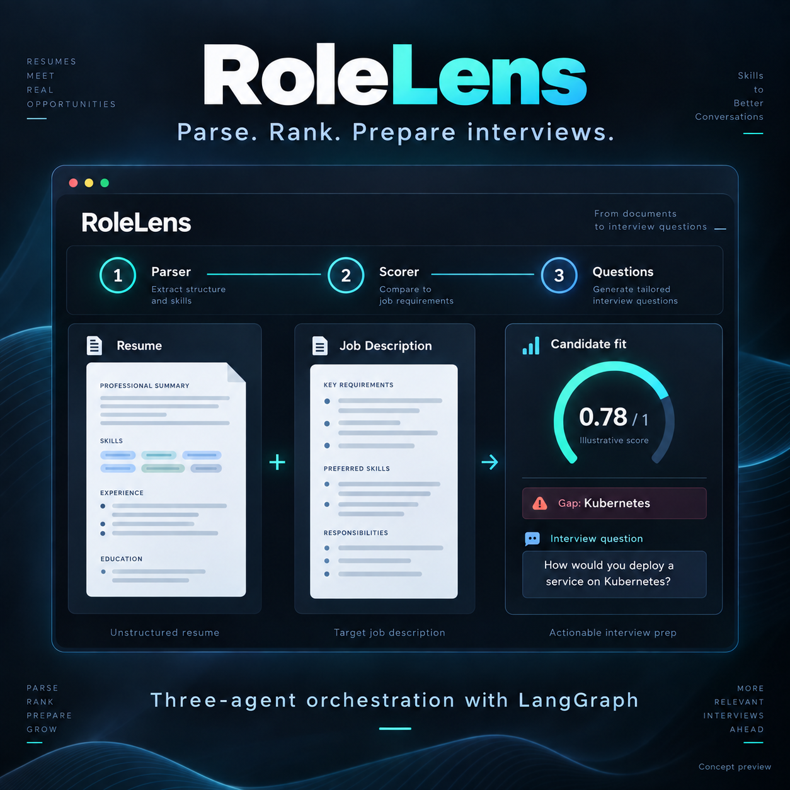
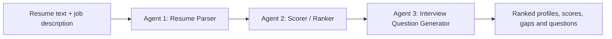

# RoleLens — Three-Agent Candidate Matching



A Python project that compares resumes with a job description, ranks candidates with an explainable 0–1 fit score, and generates interview questions from candidate gaps. LangGraph coordinates exactly three specialized agents. Ollama handles structured extraction and question generation, while Sentence Transformers provides semantic similarity.

Use the local web page to upload PDF resumes, run the CLI with text files, or retrieve resume chunks from the existing PostgreSQL/PGVector store.

## Three-step workflow



| Step | Agent | Responsibility |
| --- | --- | --- |
| 1 | [Resume Parser](src/graph/nodes/resume_parser.py) | Extracts skills, years of experience, seniority and education from each resume, plus explicit mandatory requirements from the job description. |
| 2 | [Scorer / Ranker](src/graph/nodes/scorer_ranker.py) | Combines semantic similarity with deterministic matching rules, sorts candidates, and identifies gaps in the supplied evidence. |
| 3 | [Interview Question Generator](src/graph/nodes/interview_q_generator.py) | Generates up to six practical questions per candidate tied to identified gaps, with guidance on what evidence to listen for. |

[workflow.py](src/graph/workflow.py) connects the agents in that order using a typed LangGraph `StateGraph`. Candidates with no identified rule-based gaps receive no gap questions.

## Quick start: local web page

### Prerequisites

- Python 3.12.
- Ollama installed and running locally.
- Internet access for dependency installation and initial model downloads.

PostgreSQL is optional and is not needed for PDF uploads or text-file analysis.

### Install and launch

Run these commands from the project root:

```bash
python3 -m venv .venv-agents
source .venv-agents/bin/activate
pip install -r requirements-agents.txt
ollama pull llama3.2:latest
python web_app.py
```

If Ollama is not already running as a service, run `ollama serve` in a separate terminal before pulling the model.

Open **http://127.0.0.1:8000**:

1. Paste a job description or click **Load example**.
2. Upload 1–10 PDF resumes (up to 5 MB and 30 pages each).
3. Click **Analyze candidates**.
4. Review ranked candidates, extracted profiles, score breakdowns, gaps and interview questions.

The page accepts PDF resumes with extractable text. Job descriptions must contain 20–20,000 characters, and each extracted resume must contain 20–50,000 characters. Encrypted PDFs are rejected; scanned PDFs need OCR before upload. The first analysis downloads `all-MiniLM-L6-v2` if it is not cached and may take longer.

Each upload generates a unique batch ID and saves files relative to the project root:

```text
data/resumes/<batch_id>/<generated_name>.pdf
data/jobs/<batch_id>.txt
```

The server reads the saved PDF paths to extract complete resume text, and reads the saved job file for analysis. Original PDF filenames remain candidate labels; disk filenames are generated to avoid collisions. The job file preserves the input exactly. Valid uploads remain saved even if model analysis fails. Invalid batches are removed. The result includes `saved_files` with the saved paths, also available under **Saved files** on the page.

To use another port:

```bash
python web_app.py --port 8080
```

The server binds to `127.0.0.1`, processes one analysis at a time, and persists uploaded PDFs and job descriptions locally. It is intended for local testing.

## Command-line usage

Analyze complete resume text files against a job description:

```bash
python main.py --job job.txt --resumes resume1.txt resume2.txt
```

The CLI prints JSON containing:

- `requirements`: extracted mandatory job requirements.
- `candidates`: ranked profiles with candidate IDs, labels, fit scores, component scores, effective weights, matched skills, gaps and interview questions.
- `stages`: the three completed agent names in execution order.

You can also call the workflow from Python:

```python
from src.graph.workflow import analyze

result = analyze({
    "job_description": "Backend engineer requiring Python, Docker and 3 years of experience.",
    "resumes": [{
        "label": "Candidate 1",
        "text": "Backend developer with 2 years of professional Python experience.",
    }],
})

for candidate in result["candidates"]:
    print(candidate["rank"], candidate["label"], candidate["fit_score"])
    print(candidate["gaps"])
    print(candidate["questions"])
```

## How scoring works

Agent 2 combines the following signals:

| Signal | Base weight | Calculation |
| --- | --- | --- |
| Semantic similarity | 45% | Cosine similarity between job and resume embeddings, clipped to [0, 1]. |
| Required skills | 35% | Fraction of required skills found in the extracted profile. |
| Experience | 10% | Candidate years divided by required years, capped at 1. |
| Seniority | 5% | Candidate level divided by required level, capped at 1; levels run from junior to lead. |
| Education | 5% | Fraction of required normalized credentials found in the profile. |

```text
fit_score = sum(component_score × base_weight) / sum(active_base_weights)
```

A rule component is included only when the job specifies the corresponding requirement; experience requires a positive minimum. The remaining weights are normalized. Unknown candidate evidence contributes zero for the relevant requirement. Results expose both the component scores and effective weights.

Skills use normalized exact matching with a small alias map, such as `JS → JavaScript` and `K8s → Kubernetes`. Education uses normalized exact credential matching; higher degrees or equivalent qualifications do not automatically satisfy another credential. The weights and matching rules are defined in [scorer_ranker.py](src/graph/nodes/scorer_ranker.py).

These scores are heuristic fit measures, not calibrated probabilities. A gap means evidence was not found in the supplied text. Review model extraction and gaps before using results in a hiring decision.

## Optional RAG retrieval

The existing retrieval subsystem can select candidates from an already populated PostgreSQL database with PGVector before running the same three agents:

```bash
pip install -r requirements.txt
python main.py --job job.txt --retrieve
```

Configure the database connection in the project-root `.env`:

```dotenv
DB_USER=your_user
DB_PASSWORD=your_password
DB_HOST=localhost
DB_PORT=5432
DB_NAME=your_database
```

The retriever:

1. Retrieves up to `TOP_K_RETRIEVE = 4` candidate chunks from the vector store.
2. Deduplicates them by source.
3. Reranks them with `cross-encoder/ms-marco-MiniLM-L-6-v2`.
4. Returns up to `TOP_K_RERANK = 2` chunks for the three-agent workflow.

These defaults are defined in [src/config.py](src/config.py). The cross-encoder selects retrieved candidates; Agent 2 independently computes the final fit score using its own semantic and rule-based signals.

Retrieval mode evaluates the returned chunks, not reconstructed full resumes. Evidence elsewhere in a resume may be missed. Use complete text files or PDF uploads when testing full-profile extraction.

The existing [loader](src/loaders/ingest.py) reads PDFs under `data/resumes/` and job text files under `data/jobs/`. Its legacy extraction code additionally requires `langchain-ollama`, which is not listed in the original `requirements.txt`. The [storage helper](src/embeddings/embed_store.py) uses the `resume_job_matching` collection. **`store_documents()` drops existing vector tables before recreating them**, so review it before using it with stored data. Neither the web page nor the CLI automatically ingests or rebuilds the database.

## Configuration

The agent model client reads these optional `.env` settings:

```dotenv
OLLAMA_MODEL=llama3.2:latest
OLLAMA_BASE_URL=http://localhost:11434
```

Keep existing database settings when adding these values. Embedding and retrieval model names are configured in [src/config.py](src/config.py). With the default Ollama URL, inference runs locally.

## Project structure

```text
main.py                              # CLI: text files or existing retrieval
web_app.py                           # Local HTTP server and analysis endpoint
web/index.html                       # Simple test page
requirements-agents.txt              # Dependencies for the three-agent workflow
requirements.txt                     # Original retrieval-stack dependencies
src/
  config.py                          # Model names and retrieval settings
  graph/
    models.py                        # Validated input and LLM output schemas
    services.py                      # Ollama client and lazy embedding model
    workflow.py                      # Shared state and three-agent graph
    nodes/
      resume_parser.py               # Agent 1
      scorer_ranker.py               # Agent 2
      interview_q_generator.py       # Agent 3
  loaders/ingest.py                   # Existing PDF/text loading and chunking
  embeddings/embed_store.py          # Existing PGVector storage
  retrievers/retriever.py             # Vector search and cross-encoder reranking
  prompt_chain/prompt_chain.py        # Legacy question-generation chain
tests/
  test_workflow.py                    # Agent order, scoring and ranking tests
  test_web_workflow.py                # HTTP validation and analysis tests
```

## Tests

```bash
python -m unittest discover -s tests -p 'test_*workflow.py' -v
```

The focused tests exercise the compiled graph and local HTTP API with deterministic LLM and embedding doubles. They cover agent order, ranking, scoring, missing evidence, gap-linked questions, invalid input and model errors. They do not measure live model quality or verify the PostgreSQL pipeline.

## Troubleshooting

- **Analysis fails:** check that Ollama is running, `ollama list` includes the configured model, and the embedding model can download or is cached. See the server terminal for details.
- **Another analysis is running:** wait for it to finish, then retry.
- **`ModuleNotFoundError: urllib3.packages`:** the original `.venv` was found to have an inconsistent dependency installation. Use the fresh `.venv-agents` environment from the quick start.
- **Unexpected extracted fields or gaps:** review the original text and extracted profile. Structured JSON validates the output shape, but does not guarantee factual extraction accuracy.
